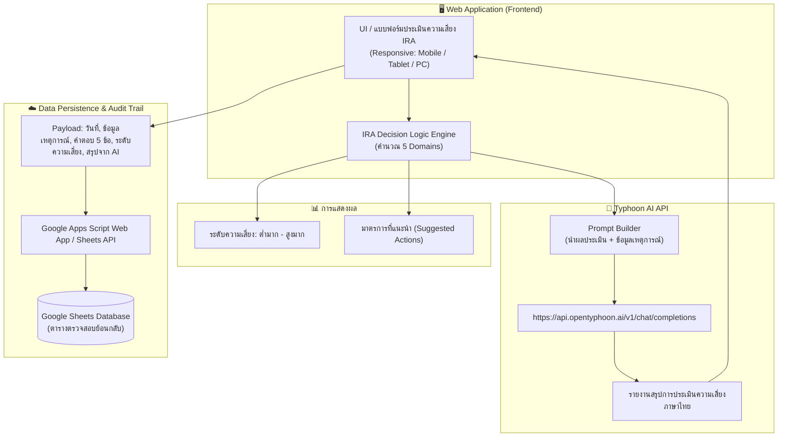
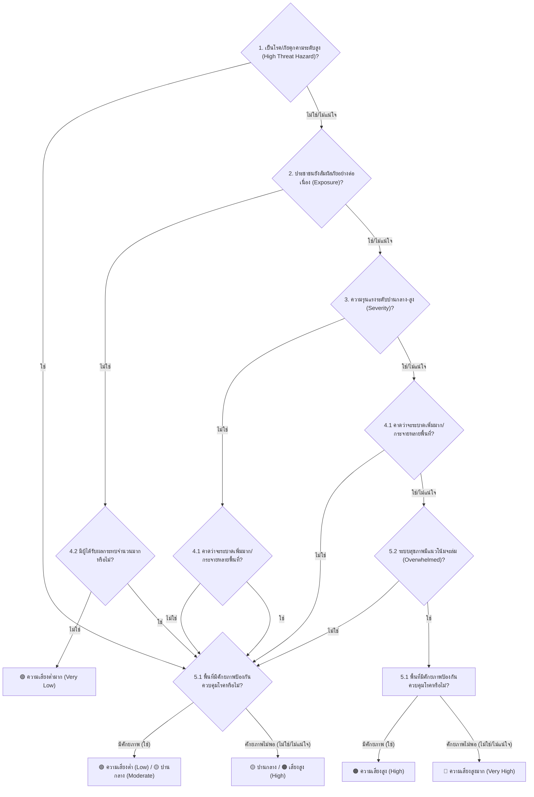

# 📋 เอกสารการออกแบบระบบประเมินความเสี่ยงเหตุการณ์ฉุกเฉินทางสาธารณสุข
## (Public Health Initial Risk Assessment System: IRA Assistant)

---

## 1. บทนำและเป้าหมายของระบบ (Overview & Objectives)
ระบบนี้ถูกออกแบบมาเพื่อเป็นเครื่องมือช่วยเจ้าหน้าที่สาธารณสุข (EOC / RRT / กลุ่มงานระบาดวิทยา) ในการประเมินความเสี่ยงต่อเหตุการณ์ฉุกเฉินทางสาธารณสุขเบื้องต้นอย่างเป็นระบบ รวดเร็ว และเป็นมาตรฐานเดียวกัน โดยมีคุณสมบัติหลัก:
1. **IRA Algorithm Engine:** วิเคราะห์ระดับความเสี่ยงตามตรรกะ **WHO Initial Risk Assessment (5 Domains)** แบบ Interactive Step-by-Step
2. **Dynamic Risk & Action Output:** คำนวณระดับความเสี่ยง (Very Low ถึง Very High) พร้อมข้อเสนอแนะเชิงนโยบาย/มาตรการควบคุมทันที
3. **Audit Trail & Google Sheets Integration:** จัดเก็บประวัติการประเมินลง Google Sheets เพื่อความโปร่งใสและตรวจสอบย้อนหลังได้ (Traceability)
4. **AI Narrative Summary (Typhoon AI API):** เชื่อมต่อ LLM ภาษาไทยขนาดใหญ่ (Typhoon) เพื่อเรียบเรียงเป็นรายงานบรรยายสถานการณ์ ผลการประเมินความเสี่ยง และข้อเสนอแนะเชิงมาตรการในรูปแบบทางการ

---

## 2. โครงสร้างสถาปัตยกรรมระบบ (System Architecture)



---

## 3. ผังตรรกะการประเมินความเสี่ยง (IRA Algorithm Logic)

อ้างอิงตามเกณฑ์ WHO Initial Risk Assessment Algorithm (หน้า 26–40):



---

## 4. รายละเอียดชุดคำถาม 5 Domains และเกณฑ์การประเมิน

### Domain 1: ภัยคุกคามระดับสูง (High Threat Hazard)
* **เกณฑ์:** เป็นเชื้อตาม พรบ.โรคติดต่ออันตราย 13 โรค, New Coronavirus, Novel Influenza, Wild Polio, Rift Valley Fever, หรือ Anthrax Bioterrorism
* **ผลลัพธ์:** หาก **"ใช่"** ให้ข้ามไปขั้นตอนประเมินขีดความสามารถ (Domain 5) ทันที

### Domain 2: การสัมผัส (Exposure)
* **เกณฑ์การตอบ "ใช่":** ต้องครบทั้ง 3 องค์ประกอบ (A AND B AND C)
  * A: ตัวเชื้อ/ต้นตอภัยยังคงมีอยู่
  * B: มีการสัมผัสทางกายภาพ สิ่งแวดล้อม สัตว์ หรืออาหาร/น้ำ
  * C: ประชากรกลุ่มเสี่ยงไม่มีภูมิคุ้มกัน (Susceptible) หรือได้รับสารเคมีเข้มข้น

### Domain 3: ความรุนแรง (Severity)
* **เกณฑ์การตอบ "ใช่":** เข้าเกณฑ์ข้อใดข้อหนึ่งอย่างน้อย 1 ข้อ (A OR B OR C)
  * A: Case Fatality Rate (CFR) > 1% (ปานกลาง 1-10%, สูง >10%)
  * B: อัตราผู้ป่วยวิกฤตสูง มีภาวะแทรกซ้อนรุนแรงหรือเรื้อรัง
  * C: อัตราป่วย/ตายสูงผิดปกติเมื่อเทียบกับค่ามาตรฐานอดีต

### Domain 4: ศักยภาพการแพร่กระจาย (Spread Potential)
* **กรณีที่ยังมีการสัมผัส (4.1):** เข้าเงื่อนไข A (A1 ธรรมชาติของโรคติดต่อสูง + A2 โอกาสสัมผัสบ่อย/รวมกลุ่มคน) หรือ B (Attack Rate สูงรวดเร็ว) หรือ C (พบผู้ป่วยปานกลางถึงมากในเวลากระชั้นชิดแม้ไม่ทราบเชื้อ)
* **กรณีสิ้นสุดการสัมผัสแล้ว (4.2):** มีผู้ได้รับผลกระทบสะสมจำนวนมากเกินระดับปกติหรือไม่

### Domain 5: ขีดความสามารถของระบบ (Capacity & Overwhelm)
* **5.1 ศักยภาพการควบคุม:**
  * **มีศักยภาพ (ใช่):** มีมาตรการสาธารณสุขพร้อม (A) + ระบบรักษาพยาบาล/เตียง/ยารองรับได้ (B) + สื่อสารความเสี่ยงชุมชนมีประสิทธิภาพ (C) และ **ไม่มีอุปสรรควิกฤต** เช่น ชุมชนไม่สงบ/ภัยซ้อน/การตีตรา (D = ไม่ใช่)
* **5.2 การล่มของระบบสุขภาพ (Overwhelmed):**
  * คาดการณ์ผู้ป่วยใน/ICU เกินขีดความสามารถของโรงพยาบาลและเวชภัณฑ์

---

## 5. การจัดระดับความเสี่ยงและมาตรการตอบสนอง (Matrix Mapping)

| ผลลัพธ์ระดับความเสี่ยง | คำแนะนำเชิงมาตรการ (Suggested Actions) | รหัสสี UI |
| :--- | :--- | :--- |
| **ต่ำมาก (Very Low)** | • ดำเนินการตามภาวะปกติ (Business as usual)<br>• ยุติการติดตามสัญญาณเหตุการณ์นี้ | `#22c55e` (เขียว) |
| **ต่ำ (Low)** | • ติดตามสถานการณ์ผ่านระบบเฝ้าระวังปกติ<br>• แจ้งประสานข้อมูลกับพื้นที่ใกล้เคียงหรือหน่วยงานที่เกี่ยวข้อง | `#84cc16` (เขียวอ่อน) |
| **ปานกลาง (Moderate)** | • รายงานผู้บริหารสูงขึ้น 1 ระดับ<br>• พิจารณาส่งทีมเฝ้าระวังสอบสวนโรคเคลื่อนที่เร็ว (RRT) ลงพื้นที่<br>• ให้การสนับสนุนห้องปฏิบัติการ (Lab) และเวชภัณฑ์ | `#eab308` (เหลือง) |
| **สูง (High)** | • รายงานผู้บริหารระดับสั่งการทันที<br>• ส่งทีม RRT เข้าควบคุมในพื้นที่ทันที<br>• **พิจารณาเปิดศูนย์ปฏิบัติการภาวะฉุกเฉิน (EOC ระดับพื้นที่/จังหวัด)** | `#f97316` (ส้ม) |
| **สูงมาก (Very High)** | • รายงานผู้บริหารระดับสูงสุดทันที<br>• **เปิด EOC ระดับชาติ (National Level EOC)**<br>• ยกระดับการตอบโต้ และพิจารณาร้องขอความช่วยเหลือระดับนานาชาติ | `#ef4444` (แดง) |

---

## 6. การเชื่อมต่อ Typhoon AI API (Narrative Summary Generator)

### 6.1 วัตถุประสงค์
แปลงข้อมูลตัวแปรทางระบาดวิทยา ตัวเลือกที่ผู้ใช้กรอก และระดับความเสี่ยงที่ระบบคำนวณได้ ให้เป็น **"บทบรรยายสถานการณ์และผลการประเมินความเสี่ยง"** ที่เป็นภาษาราชการ/ระบาดวิทยาอย่างสละสลวย (เหมือนตัวอย่างหน้า 66-67)

### 6.2 ตัวอย่าง Prompt Template
```markdown
คุณเป็นแพทย์ผู้เชี่ยวชาญด้านระบาดวิทยาและเวชศาสตร์ป้องกัน ทำหน้าที่เขียนสรุปผลการประเมินความเสี่ยง (Initial Risk Assessment Report)

[ข้อมูลเหตุการณ์]
- ชื่อเหตุการณ์: {{eventName}}
- สถานที่เกิดเหตุ: {{location}}
- วันที่ประเมิน: {{assessmentDate}}
- ผู้รายงาน/ตำแหน่ง: {{assessorName}}
- รายละเอียดผู้ป่วยและอาการ: {{clinicalDescription}}

[ผลการประเมินตามเกณฑ์ IRA 5 Domains]
- ภัยคุกคามระดับสูง: {{domain1_result}}
- การสัมผัสต่อเนื่อง: {{domain2_result}}
- ความรุนแรงทางคลินิก: {{domain3_result}}
- ศักยภาพการแพร่กระจาย: {{domain4_result}}
- ศักยภาพด้านสาธารณสุข: {{domain5_result}}
- ระดับความเสี่ยงที่ประเมินได้: {{calculatedRiskLevel}}

กรุณาเขียนสรุป 3 ย่อหน้า:
ย่อหน้าที่ 1: สรุปสถานการณ์ เหตุการณ์ ผู้ป่วย และการกระจายตัวของโรค
ย่อหน้าที่ 2: วิเคราะห์ระดับความเสี่ยง โดยอธิบายเหตุผลประกอบจากปัจจัยการสัมผัส ความรุนแรง และศักยภาพในการรับมือ
ย่อหน้าที่ 3: ข้อเสนอแนะเชิงมาตรการควบคุมโรคและการเปิดศูนย์ EOC ที่สอดคล้องกับระดับความเสี่ยง
```

### 6.3 API Specification (Typhoon)
* **Endpoint:** `POST https://api.opentyphoon.ai/v1/chat/completions`
* **Headers:** 
  * `Authorization: Bearer <TYPHOON_API_KEY>`
  * `Content-Type: application/json`
* **Model:** `typhoon-v1.5x-70b-instruct` หรือ `typhoon-v2-70b-instruct`
* **Temperature:** `0.2` (เพื่อให้ได้ผลการวิเคราะห์ที่แม่นยำ ไม่เพ้อฝัน)

---

## 7. การเชื่อมต่อ Google Sheets สำหรับตรวจสอบย้อนหลัง (Audit Trail)

### 7.1 โครงสร้างคอลัมน์ใน Google Sheets
ตารางบันทึกการประเมินประกอบด้วยคอลัมน์มาตรฐาน:
1. `Timestamp`: วันที่และเวลาที่บันทึกระบบ
2. `Assessment_ID`: รหัสอ้างอิง เช่น `IRA-20261002-001`
3. `Event_Name`: ชื่อเหตุการณ์
4. `Location_Province`: จังหวัด/พื้นที่เกิดเหตุ
5. `Assessor_Name`: ผู้ประเมิน
6. `Domain1_HighThreat`: ผลประเมินภัยคุกคามสูง (Yes/No + รายละเอียด)
7. `Domain2_Exposure`: ผลประเมินการสัมผัส (Yes/No)
8. `Domain3_Severity`: ผลประเมินความรุนแรง (Yes/No)
9. `Domain4_Spread`: ผลประเมินการแพร่กระจาย (Yes/No)
10. `Domain5_Capacity`: ผลประเมินศักยภาพระบบ (Sufficient/Insufficient/Overwhelmed)
11. `Overall_Risk_Level`: ผลลัพธ์ระดับความเสี่ยง (Very Low / Low / Moderate / High / Very High)
12. `Recommended_Actions`: มาตรการตอบสนองที่แนะนำ
13. `AI_Narrative_Summary`: บทบรรยายสรุปจาก Typhoon AI
14. `Status`: สถานะของเหตุการณ์ (Active / Closed / Re-assessed)

### 7.2 ช่องทางการเชื่อมต่อ (Integration Method)
* **ทางเลือกที่ 1 (แนะนำสำหรับ Web App ไร้ Backend หนัก):** ใช้ **Google Apps Script Web App** เป็น REST Endpoint รับ `POST` JSON แล้ว appendRow ลงชีต ปลอดภัย ไม่ต้องเปิด Public Service Account Key ในฝั่ง Client
* **ทางเลือกที่ 2 (กรณีมี Backend Node.js/Python):** ใช้ Service Account credentials ผ่าน Google Sheets API v4

---

## 8. การออกแบบส่วนติดต่อผู้ใช้งาน (UI/UX Design Concept)

* **Layout:** Card-based Wizard Step 1 ถึง 5 พร้อม Progress Bar แสดงขั้นตอน
* **Theme:** Clean Medical Dashboard (Dark/Light Mode), ใช้ Glassmorphism เล็กน้อย ให้ความรู้สึกทันสมัย น่าเชื่อถือ
* **Interactive Tooltips:** มีตัวช่วยอธิบายเกณฑ์ย่อย เช่น กดดูนิยาม CFR, สัญญาณเตือนระบบสุขภาพล่ม
* **Live Assessment Summary:** แสดงการ์ดผลลัพธ์พร้อมสีตามระดับความเสี่ยง (Badge), ข้อเสนอแนะตามมาตรฐานกระทรวงสาธารณสุข
* **Action Buttons:**
  * 🪄 **"สร้างรายงานสรุปอัตโนมัติด้วย Typhoon AI"** (พร้อมปุ่มคัดลอก/ส่งออกเป็น PDF)
  * 💾 **"บันทึกลง Google Sheets เพื่อตรวจสอบย้อนหลัง"** (พร้อมลิงก์เปิดดู Sheet)
  * 🔄 **"ประเมินเหตุการณ์ใหม่"**

---

## 9. ขั้นตอนการพัฒนาระบบ (Implementation Roadmap)

1. **Step 1:** พัฒนา Frontend & Component Logic สำหรับคำนวณอัลกอริทึม IRA ทั้ง 5 ขั้นตอน (HTML/Tailwind/Vanilla JS หรือ Next.js/Vite)
2. **Step 2:** พัฒนาตัวเชื่อมต่อ Typhoon AI API สำหรับนำคำตอบมารวมเป็น Structured Prompt และรับบทสรุปกลับมาแสดงผล
3. **Step 3:** สร้าง Google Apps Script Web App + เตรียม Google Sheet Template และทำ Function ส่งข้อมูลจากเว็บไปบันทึก
4. **Step 4:** ตรวจสอบความถูกต้องของตรรกะการให้ระดับความเสี่ยงกับเอกสารของกรมควบคุมโรค (หน้า 26–28)
5. **Step 5:** ทดสอบและปรับปรุงการแสดงผลให้รองรับทั้ง Desktop, Tablet และ Mobile ตามข้อกำหนดเดิม
